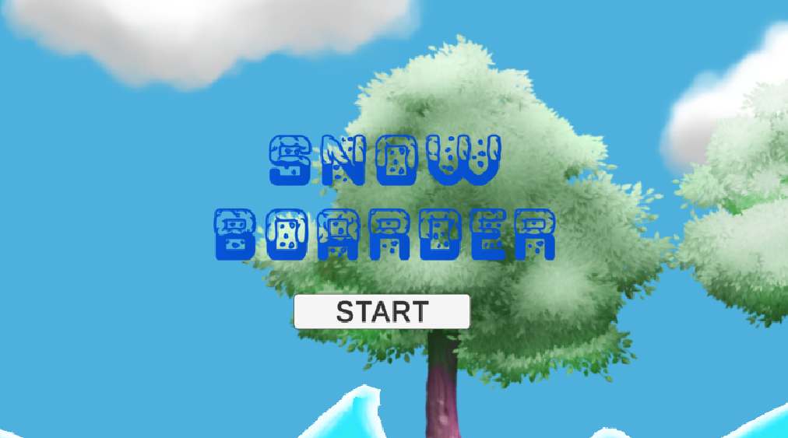

# SNOW BOARDER

눈 덮인 산을 내려오며 회전과 점프를 조절해 완주하는 2D 물리 기반 스노우보드 게임  
A 2D physics-driven snowboarding game — spin, boost, and balance your way to the finish line!

<p align="center">
  <a href="#demo">🎮 플레이 영상</a> •
  <a href="#features">✨ 주요 특징</a> •
  <a href="#tech-stack">🧰 기술 스택</a> •
  <a href="#setup">⚙️ 설치/실행</a> •
  <a href="#screenshots">🖼️ 스크린샷</a>
</p>

<p>
  
  
</p>

---

## TL;DR

* **장르**: 2D Physics / Casual Sports  
* **엔진**: Unity 2021.3.45
* **역할(Role)**: 기획 100%, 프로그래밍 100%  
* **플레이 루프**: 회전 조작 → 가속 → 착지 성공 → 골인 → 다음 스테이지 진입

---

<h2 id="demo">🎮 플레이 영상</h2>

▶️ Gameplay Video: [게임 플레이 영상](https://youtu.be/ei616F_wYBg)

방향키로 회전하고, 위쪽 키로 속도를 높여 스노우보드를 조종하세요.  
충돌 시 눈가루 이펙트와 사운드가 발생하며 2 초 후 재시작됩니다.

---

<h2 id="features">✨ 주요 특징 / Features</h2>

* 🏂 **물리 기반 보드 조작** — `Rigidbody2D` + `SurfaceEffector2D` 로 슬로프 마찰 및 중력 재현  
* 💨 **가속 시스템** — ↑ 키로 부스터 속도 전환 (`boostSpeed / baseSpeed`)  
* 💥 **충돌 처리 & 리로드** — `CrashDetector` 가 Ground 충돌 감지 → 이펙트 → 씬 전환  
* ❄️ **눈가루 트레일 연출** — `DustTrail` 이 지면 접촉 상태에 따라 파티클 제어  
* 🏁 **결승선 연출** — `FinishLine` 에서 파티클 + 사운드 + 씬 전환 구현  
* 🎵 **배경음악 싱글톤** — 씬 전환 간 BGM 유지 (`BackgroundMusic`)  
* 🎥 **메인 메뉴 카메라 루프** — 카메라가 좌우로 자연스럽게 이동하며 루프 효과 제공  

---

<h2 id="tech-stack">🧰 기술 스택 / Tech Stack</h2>

**엔진**: Unity 2021.3.45 
**언어**: C#  
**툴 및 시스템**:  
- 2D Physics (Rigidbody2D, SurfaceEffector2D)  
- Particle System  
- AudioSource / AudioClip  
- SceneManagement API  
- Unity Input System  
- VS Code / Git  

**핵심 시스템 구성**

| 시스템 | 설명 |
|---------|------|
| **PlayerController** | 회전 및 가속 조작, 물리 토크 처리 |
| **CrashDetector** | 충돌 감지 및 사운드/이펙트/씬 전환 |
| **DustTrail** | 지면 접촉 상태에 따라 눈가루 이펙트 제어 |
| **FinishLine** | 결승선 트리거 시 다음 씬 또는 GameClear 이동 |
| **BackgroundMusic** | BGM 싱글톤 관리, 중복 방지 |
| **MainMenuCamera** | 메뉴 씬 카메라 이동 루프 연출 |
| **GameManager** | 씬 로드 관리 (게임 시작 / 메인 메뉴 이동) |

---

<h2 id="architecture">🏗️ 프로젝트 구조 / Architecture</h2>

```
Assets/
  SnowBoarder/
    Scripts/
      Player/
        PlayerController.cs
        DustTrail.cs
      System/
        CrashDetector.cs
        FinishLine.cs
        GameManager.cs
        BackgroundMusic.cs
      UI/
        MainMenuCamera.cs
      Scenes/
        MainMenu.unity
        Level1.unity
        GameOver.unity
        GameClear.unity
```

**설계 포인트**
- 입력, 피드백(사운드/파티클), 씬 전환이 모듈화되어 유지보수 용이  
- `SurfaceEffector2D` 를 활용한 자연스러운 슬라이딩 감 구현  
- `Invoke()` 딜레이 기반 씬 전환으로 부드러운 연출  
- `DontDestroyOnLoad` 활용 BGM 유지  

---

<h2 id="setup">⚙️ 설치 및 실행 / Setup</h2>

저장소 클론

git clone https://github.com/<YOUR_ID>/RoyalRun.git


Unity Hub에서 프로젝트 열기

Packages 자동 복구 후, Assets/Scenes/Demo.unity 실행

▶️ Play

에셋 의존성이 있는 경우, Readme/팝업 안내에 따라 의존 패키지를 함께 설치하세요.

---

<h2 id="controls">🎮 조작법 / Controls</h2>

| 동작    | 조작         | 설명 |
| ----- | ---------- | ------- |
| 왼쪽 회전    |←| 반시계 방향 기울기 |
| 오른쪽 회전  | → | 시계 방향 기울기 | 
| 부스터 가속 | ↑ | 속도 증가|

---

<h2 id="screenshots">🖼️ 스크린샷 / Screenshots</h2> <p align="center">   </p>

점프와 회전을 이용해 코스를 지나 결승선을 통과하면 골인 사운드가 주어집니다.
충돌 시에는 게임오버 씬으로 전환됩니다.

---

<h2 id="roadmap">🚀 향후 계획 / Roadmap</h2>

* [ ]  점프 트릭 점수 시스템 추가

* [ ]  타임어택 / 기록 저장 기능

* [ ]  모바일 터치 조작 대응

* [ ]  캐릭터 커스터마이징 및 스킨 추가

 ---

<h2 id="credits">👤 제작자 / Credits</h2>

* **기획·개발**: 김영무 (Kim YoungMoo)

* **아트 리소스**: 2D Snow Mountain Pack

* **사운드**: 무료 SFX / 자체 믹싱
  
* **참고 강의**: [강의 링크](https://www.udemy.com/course/best-c-unity-2d/?kw=c%23&src=sac&couponCode=MT251110G1)


 ---
 
<h2 id="contact">📬 연락처 / Contact</h2>

* **이메일**: [rladuan612@gmail.com](mailto:rladuan612@gmail.com)
* **포트폴리오**: [포트폴리오](https://www.naver.com)
